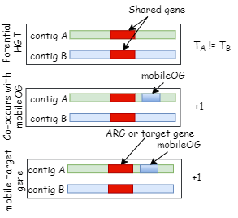

Kairos derep-detect
=====

.. _Kairos derep-detect:

see :doc:`installation` for installing

.. code-block:: console

.. dereplicate contigs by detecting identical orfs in contigs:

description
------------

Kairos assess detects identical genes in distinct genetic contexts. Kairos derep-detect identifies identical orfs in contigs and assesses their redundancy based on the proportion of orfs that are shared to those that are unique. Putative HGTs are those events where identical orfs occur in two contigs with differing taxonomic assignment. Potential HGTs are scored based on whether the putatively transfered gene is a target gene and/or co-localized with an MGE hallmark gene. 

input
------------

inputs to Kairos derep-detect are a fasta file of contigs, a target gene database (by default, deepARG-db is recommended) and a database of MGE hallmark genes (mobileOG-db is recommended). 

**input parameters**

* taxa_df = null 

   input taxonomy dataframe of format: contig classification
 
* input_contigs = null	
   
   input contigs in fasta format

* outprefix = 'kairos'    
   
   job title that will be used for file naming   

**clustering and detection parameters**

* mmseqs_prot_cov = 0.3

   the mmseqs -c parameter used during identical orf identification

* mmseqs_prot_id = 0.99

   the mmseqs --id parameter used during identical orf identification

* mmseqs_prot_cov_mode = 1

   the mmseqs --cov-mode parameter used during identical orf identification

* mmseqs_contig_cov = 0.6

   the mmseqs -c parameter used during initial contig dereplication 

* mmseqs_contig_id = 0.99

   the mmseqs -c parameter used during initial contig dereplication 

* mmseqs_contig_cov_mode = 1

   the mmseqs -c parameter used during initial contig dereplication    

* max_overlap = 0.5

   the maximum proportion of shared ORFs between two contigs to be considered non-redundant 

* min_orfs = 1

   minimum number of orfs in a contig to consider for HGT analysis

**database input commands**

* target_database=null

   absolute path to target database (deepARG-db by default) 

* MGE_database=null

   absolute path to MGE database (mobileOG-db by default)

**diamond alignment parameters**

* MGE_id = 0.3

   identity value for MGE annotation
   
* MGE_e = 1e-5

   e-value for MGE annotation

* target_id = 80 

   identity value for target annotation 

* target_e = 1e-10   

   e-value for target annotation 

* target_query_cover = 0.8

   query-cover parameter for target annotation 

* max_dist_closest_MGE = 5000 

   the closest MGE must be within this basepair distance in order to score +1 on MGE colocalization

To run derep-detect:

.. code-block:: console

   (.venv) $ nextflow kairos-dd.nf --max_cpus 128 --max_overlap 0.5 --input_contigs input.fasta --taxa_df kairos/taxadf.tsv --outdir output --target_database kairos/deeparg.fasta --MGE_database kairos/mobileOG-db_beatrix-1.6.All.faa

